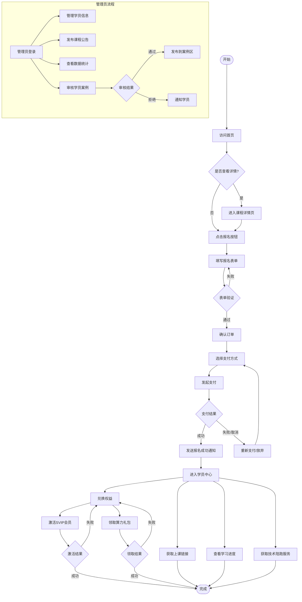

# AI创作集训营在线培训平台 - 产品需求文档（PRD）

## 文档信息

| 项目 | 内容 |
|------|------|
| 文档版本 | V1.0 |
| 创建日期 | 2026-02-06 |
| 产品名称 | AI创作集训营在线培训平台 |
| 产品定位 | 零基础AI内容创作实战培训平台，提供5天集训+2个月陪跑服务 |
| 目标用户 | 1.零基础AI创作爱好者；2.新媒体/短视频从业者；3.内容创业者；4.职场技能提升人群 |
| 核心目标 | 1.实现课程在线展示、报名、支付闭环；2.提供学员学习管理、权益兑换、技术陪跑服务入口；3.沉淀学员案例，提升平台公信力 |
| 版本规划 | V1.0基础版：实现核心功能（课程展示、报名支付、学员中心）；V2.0进阶版：新增AI学习助手、案例社区、企业团购功能 |

---

## 目录

1. [产品基础信息](#产品基础信息)
2. [核心用户故事](#核心用户故事)
3. [用户旅程地图](#用户旅程地图)
4. [用户故事详情](#用户故事详情)
5. [非功能需求](#非功能需求)
6. [运营需求](#运营需求)

---

## 核心用户故事

| 用户角色 | 用户故事 | 功能需求 |
|---------|---------|---------|
| 潜在学员 | 我想了解课程内容、价格、权益，对比后在线报名 | 课程大纲展示、优惠信息公示、在线支付、报名表单提交 |
| 已报名学员 | 我想获取上课链接、查看学习进度、领取会员权益、咨询技术问题 | 上课通知推送、学习进度跟踪、SVIP会员权益兑换入口、技术陪跑服务通道 |
| 平台运营者 | 我想管理学员信息、发布课程公告、统计报名数据、审核学员案例 | 学员管理后台、公告发布功能、数据统计报表、案例审核入口 |

---

## 用户旅程地图



---

## 用户故事详情

### US-01: 首页浏览与课程展示

**用户故事**：作为潜在学员，我想在首页快速了解课程的核心卖点、课程亮点、大纲、学员案例和优惠信息，以便决定是否报名。

#### 业务规则与逻辑

**Banner区**：
- 3张轮播图，支持自动轮播（间隔3秒）和手动切换
- 核心卖点文案："5天集训+2个月陪跑"
- 点击轮播图跳转到课程详情页

**课程亮点区**：
- 4大核心模块以图标+文字形式展示（名称待补充）
- 上课形式：腾讯会议每晚8-10点直播
- 学员权益展示：图标+文字形式

**课程大纲区**：
- 进阶/中级课程模块（具体内容待补充）
- 点击整个模块展开/收起详情

**学员案例区**：
- 每页显示20个案例，支持分页
- 案例分类标签：图文视频、小说推文、短剧
- 支持点击查看案例详情

**优惠活动区**：
- 限时优惠时间范围（待补充）
- 每月月底开课日期（待补充）
- 需要倒计时提醒
- 优惠结束后显示"优惠已结束"

**报名按钮**：
- 固定在页面底部固定栏
- 按钮文案（待补充）
- 按钮有闪烁效果

**响应式设计**：
- PC端和移动端布局符合惯例调整

**异常场景**：
- 课程满员：首页显示"已满员"状态
- 优惠结束：显示"优惠已结束"

**数据来源**：
- 目前为静态配置

#### 页面布局线框图（PC端）

```
┌─────────────────────────────────────────────────────────────────────────────┐
│  [LOGO]  AI创作集训营           首页  课程详情  学员中心  登录/注册         │
├─────────────────────────────────────────────────────────────────────────────┤
│                                                                             │
│  ┌─────────────────────────────────────────────────────────────────────┐   │
│  │                                                                     │   │
│  │                        [轮播图1]                                    │   │
│  │                    5天集训+2个月陪跑                                │   │
│  │                    零基础到专业 限时优惠立省1300元                   │   │
│  │                                                                     │   │
│  │                    [◀] ● ● ● [▶]                                    │   │
│  └─────────────────────────────────────────────────────────────────────┘   │
│                                                                             │
├─────────────────────────────────────────────────────────────────────────────┤
│  课程亮点                                                                  │
├─────────────────────────────────────────────────────────────────────────────┤
│  ┌──────────┐  ┌──────────┐  ┌──────────┐  ┌──────────┐                  │
│  │  [图标]  │  │  [图标]  │  │  [图标]  │  │  [图标]  │                  │
│  │  模块1   │  │  模块2   │  │  模块3   │  │  模块4   │                  │
│  │ (待补充) │  │ (待补充) │  │ (待补充) │  │ (待补充) │                  │
│  └──────────┘  └──────────┘  └──────────┘  └──────────┘                  │
│                                                                             │
│  ┌─────────────────────────────────────────────────────────────────────┐   │
│  │  📺 上课形式：腾讯会议每晚8-10点直播                                │   │
│  │  🎁 学员权益：半年SVIP会员 | 50元算力礼包 | 2个月技术陪跑            │   │
│  └─────────────────────────────────────────────────────────────────────┘   │
│                                                                             │
├─────────────────────────────────────────────────────────────────────────────┤
│  课程大纲                                                                  │
├─────────────────────────────────────────────────────────────────────────────┤
│  ┌─────────────────────────────────────────────────────────────────────┐   │
│  │  📚 进阶课程模块  [展开 ▼]                                          │   │
│  │    - 知识点1 (待补充)                                               │   │
│  │    - 知识点2 (待补充)                                               │   │
│  │    - 知识点3 (待补充)                                               │   │
│  └─────────────────────────────────────────────────────────────────────┘   │
│                                                                             │
│  ┌─────────────────────────────────────────────────────────────────────┐   │
│  │  📚 中级课程模块  [展开 ▼]                                          │   │
│  │    - 知识点1 (待补充)                                               │   │
│  │    - 知识点2 (待补充)                                               │   │
│  └─────────────────────────────────────────────────────────────────────┘   │
│                                                                             │
├─────────────────────────────────────────────────────────────────────────────┤
│  学员案例  [全部] [图文视频] [小说推文] [短剧]                             │
├─────────────────────────────────────────────────────────────────────────────┤
│  ┌─────────────┐  ┌─────────────┐  ┌─────────────┐  ┌─────────────┐      │
│  │  [案例缩略图] │  │  [案例缩略图] │  │  [案例缩略图] │  │  [案例缩略图] │      │
│  │  标题1      │  │  标题2      │  │  标题3      │  │  标题4      │      │
│  │  [标签]    │  │  [标签]    │  │  [标签]    │  │  [标签]    │      │
│  └─────────────┘  └─────────────┘  └─────────────┘  └─────────────┘      │
│  ┌─────────────┐  ┌─────────────┐  ┌─────────────┐  ┌─────────────┐      │
│  │  [案例缩略图] │  │  [案例缩略图] │  │  [案例缩略图] │  │  [案例缩略图] │      │
│  │  标题5      │  │  标题6      │  │  标题7      │  │  标题8      │      │
│  │  [标签]    │  │  [标签]    │  │  [标签]    │  │  [标签]    │      │
│  └─────────────┘  └─────────────┘  └─────────────┘  └─────────────┘      │
│                                                                             │
│  [◀ 上一页]  第1/5页  [下一页 ▶]                                          │
│                                                                             │
├─────────────────────────────────────────────────────────────────────────────┤
│  优惠活动                                                                  │
├─────────────────────────────────────────────────────────────────────────────┤
│  ┌─────────────────────────────────────────────────────────────────────┐   │
│  │  ⏰ 限时优惠：原价2588元 → 现价1288元  [倒计时: 05天 12:30:45]      │   │
│  │  📅 开课时间：每月月底（具体日期待补充）                             │   │
│  └─────────────────────────────────────────────────────────────────────┘   │
│                                                                             │
├─────────────────────────────────────────────────────────────────────────────┤
│  页脚：联系我们 | 关于我们 | 隐私政策 | 服务条款                          │
└─────────────────────────────────────────────────────────────────────────────┘
│                                                                             │
│  ┌─────────────────────────────────────────────────────────────────────┐   │
│  │  ⚡ [立即报名 - 限时优惠1288元] ⚡  (闪烁效果)                       │   │
│  └─────────────────────────────────────────────────────────────────────┘   │
│                                                                             │
└─────────────────────────────────────────────────────────────────────────────┘
```

#### 页面布局线框图（移动端）

```
┌─────────────────────────────┐
│  [LOGO]  ☰                │
├─────────────────────────────┤
│                             │
│  [轮播图1]                  │
│  5天集训+2个月陪跑          │
│  [◀] ● ● ● [▶]             │
│                             │
├─────────────────────────────┤
│  课程亮点                   │
├─────────────────────────────┤
│  ┌──────────┐              │
│  │  [图标]  │              │
│  │  模块1   │              │
│  └──────────┘              │
│  ┌──────────┐              │
│  │  [图标]  │              │
│  │  模块2   │              │
│  └──────────┘              │
│  ┌──────────┐              │
│  │  [图标]  │              │
│  │  模块3   │              │
│  └──────────┘              │
│  ┌──────────┐              │
│  │  [图标]  │              │
│  │  模块4   │              │
│  └──────────┘              │
│                             │
│  📺 腾讯会议每晚8-10点直播  │
│  🎁 半年SVIP | 50元算力     │
│                             │
├─────────────────────────────┤
│  课程大纲                   │
├─────────────────────────────┤
│  📚 进阶课程模块 [展开 ▼]   │
│  📚 中级课程模块 [展开 ▼]   │
│                             │
├─────────────────────────────┤
│  学员案例                   │
│  [全部] [图文] [小说] [短剧]│
├─────────────────────────────┤
│  ┌─────────────────────┐   │
│  │  [案例缩略图]        │   │
│  │  标题1              │   │
│  │  [标签]             │   │
│  └─────────────────────┘   │
│  ┌─────────────────────┐   │
│  │  [案例缩略图]        │   │
│  │  标题2              │   │
│  │  [标签]             │   │
│  └─────────────────────┘   │
│                             │
│  [◀] 1/5 [▶]               │
│                             │
├─────────────────────────────┤
│  优惠活动                   │
├─────────────────────────────┤
│  ⏰ 原价2588 → 1288元      │
│  倒计时: 05天 12:30:45     │
│  📅 每月月底开课            │
│                             │
├─────────────────────────────┤
│  页脚                       │
├─────────────────────────────┤
│  ⚡ [立即报名] ⚡           │
└─────────────────────────────┘
```

#### 验收标准

**功能验收标准**：
- Banner轮播功能：3张轮播图自动轮播（间隔3秒），支持手动切换，点击跳转到课程详情页
- 课程亮点展示：4大核心模块以图标+文字形式展示，上课形式和学员权益正确显示
- 课程大纲展开：点击模块标题可展开/收起详情
- 学员案例展示：每页显示20个案例，支持分页，案例分类标签筛选，点击查看详情
- 优惠活动展示：显示原价和现价，显示倒计时，显示开课时间，优惠结束后显示"优惠已结束"
- 报名按钮：固定在页面底部固定栏，按钮有闪烁效果，点击跳转到报名表单页
- 响应式设计：PC端和移动端布局正确适配
- 异常场景：课程满员时首页显示"已满员"状态，优惠结束后显示"优惠已结束"

**性能验收标准**：
- 首页加载时间 ≤ 2秒
- 轮播图切换流畅，无卡顿
- 案例图片懒加载，提升页面加载速度

**兼容性验收标准**：
- Chrome、Safari、Edge、Firefox 主流版本正常显示
- 微信内置浏览器正常显示
- iOS Safari 和 Android Chrome 正常显示

---

### US-02: 课程详情页浏览

**用户故事**：作为潜在学员，我想查看课程的详细介绍、模块拆解、学员权益和常见问题，以便全面了解课程内容后决定是否报名。

#### 业务规则与逻辑

**课程介绍区**：
- 培训周期：5天集训
- 上课时间：每晚8-10点直播（2026年2月25日-3月1日）
- 适合人群：零基础AI创作爱好者、新媒体/短视频从业者、内容创业者、职场技能提升人群
- 学习目标：4条（掌握AI工具、独立创作、建立作品集、了解变现路径）

**模块拆解区**：
- 4大核心模块：爆款逆向拆解、AI工具实操、内容创作实战、变现路径规划
- 每个模块显示预计学习时长
- 每个模块包含3-4个知识点

**学员权益区**：
- SVIP会员权限：5项（无限次使用AI工具、专属客服、优先体验新功能、专属回放、线下活动优先权）
- SVIP会员有效期：半年（180天）
- 50元算力礼包：500次AI生成额度
- 2个月技术陪跑服务：专属答疑群、作业批改、一对一指导、学习进度跟踪
- 学费减免政策：老学员复训5折、推荐好友返现200元

**常见问题区**：
- FAQ数量：10个
- 支持搜索功能
- 支持分类：报名相关、上课相关、退款相关
- 支持点击展开答案

**页面布局**：
- 返回首页按钮：页面左上角
- 立即报名按钮：页面顶部和底部各一个

**异常场景**：
- 课程已满员：显示"已满员"状态，禁用"立即报名"按钮
- 优惠活动已结束：显示"优惠已结束"，隐藏优惠价格，显示原价
- 课程已结束：显示"课程已结束"状态，禁用"立即报名"按钮

**数据来源**：
- 目前为静态配置

#### 验收标准

**功能验收标准**：
- 课程介绍展示：培训周期、上课时间、适合人群、学习目标正确显示
- 模块拆解展示：4大核心模块正确显示，每个模块显示预计学习时长，每个模块显示3-4个知识点
- 学员权益展示：SVIP会员权限正确显示5项，SVIP会员有效期正确显示，50元算力礼包正确显示，2个月技术陪跑服务正确显示4项内容，学费减免政策正确显示2项
- 常见问题展示：显示10个FAQ问题，支持搜索功能，支持分类筛选，支持点击展开答案
- 页面导航：返回首页按钮正常工作，顶部和底部"立即报名"按钮跳转到报名表单页
- 响应式设计：PC端和移动端布局正确适配
- 异常场景：课程满员时显示"已满员"状态，禁用报名按钮，优惠结束后显示"优惠已结束"，显示原价，课程结束后显示"课程已结束"状态，禁用报名按钮

**性能验收标准**：
- 课程详情页加载时间 ≤ 2秒
- FAQ展开/收起流畅，无卡顿

**兼容性验收标准**：
- Chrome、Safari、Edge、Firefox 主流版本正常显示
- 微信内置浏览器正常显示
- iOS Safari 和 Android Chrome 正常显示

---

### US-03: 报名表单提交与支付

**用户故事**：作为潜在学员，我想填写报名表单并完成在线支付，以便成功报名参加AI创作集训营。

#### 业务规则与逻辑

**报名表单字段**：
- 必填字段：姓名（2-20个字符）、手机号（11位数字）、微信号（6-20个字符）
- 选填字段：邮箱（标准格式）、职业（下拉选择）、学习目标（最多200字）、头像（JPG/PNG，最大2MB）

**表单验证规则**：
- 姓名：2-20个字符，支持中英文
- 手机号：11位数字，格式验证
- 微信号：6-20个字符，支持字母、数字、下划线、减号
- 邮箱：标准邮箱格式验证（如填写）
- 头像：JPG/PNG格式，最大2MB（如上传）

**支付方式**：
- 支持微信支付、支付宝
- 选择支付方式后显示对应二维码
- 支付超时时间：30分钟

**订单确认**：
- 显示课程名称、原价2588元、优惠价1288元、优惠金额1300元、实付金额1288元
- 显示报名人信息：姓名、手机号、微信号、邮箱
- 显示订单编号：自动生成

**支付成功后**：
- 跳转到支付成功页
- 发送短信通知到报名手机号
- 发送邮件通知到报名邮箱（如填写）
- 生成电子收据，支持下载PDF

**异常场景**：
- 支付超时：订单自动取消，提示用户"支付超时，请重新下单"
- 支付失败：提示用户"支付失败，请重新支付或联系客服"，提供"重新支付"和"联系客服"按钮
- 重复提交表单：前端防重复提交机制（提交后禁用按钮），后端幂等性校验
- 课程已满员：显示"课程已满员"提示，禁止报名

**数据存储**：
- 报名信息存储在数据库，敏感信息（手机号、微信号）加密存储
- 支付记录存储在数据库

**页面跳转**：
- 报名表单页：返回课程详情页按钮（左上角）
- 支付成功页：返回首页和进入学员中心的按钮

#### 验收标准

**功能验收标准**：
- 报名表单填写：必填字段（姓名、手机号、微信号），选填字段（邮箱、职业、学习目标、头像），表单验证规则正确执行，头像上传支持JPG/PNG格式，最大2MB
- 表单验证：姓名（2-20个字符，支持中英文），手机号（11位数字，格式验证），微信号（6-20个字符，支持字母、数字、下划线、减号），邮箱（标准邮箱格式验证，如填写），验证失败时显示错误提示
- 订单确认：正确显示课程名称、订单编号，正确显示报名人信息（姓名、手机号、微信号、邮箱），正确显示费用明细（原价、优惠金额、实付金额），手机号脱敏显示（如138****8888）
- 支付方式：支持微信支付、支付宝，选择支付方式后显示对应二维码，支付超时倒计时显示（30分钟）
- 支付成功后：跳转到支付成功页，发送短信通知到报名手机号，发送邮件通知到报名邮箱（如填写），生成电子收据，支持下载PDF
- 异常场景：支付超时（订单自动取消，提示重新下单），支付失败（提示重新支付或联系客服），重复提交（前端防重复提交，后端幂等性校验），课程已满员（显示"课程已满员"，禁止报名）
- 页面导航：报名表单页返回课程详情页按钮正常工作，支付成功页返回首页和进入学员中心按钮正常工作
- 响应式设计：PC端和移动端布局正确适配

**性能验收标准**：
- 报名表单页加载时间 ≤ 2秒
- 表单提交响应时间 ≤ 1秒
- 支付二维码加载时间 ≤ 2秒

**安全验收标准**：
- 敏感信息（手机号、微信号）加密存储
- 支付数据加密传输
- 防止SQL注入、XSS攻击

**兼容性验收标准**：
- Chrome、Safari、Edge、Firefox 主流版本正常显示
- 微信内置浏览器正常显示
- iOS Safari 和 Android Chrome 正常显示

---

### US-04: 学员中心首页

**用户故事**：作为已报名学员，我想在学员中心查看个人信息、学习进度、上课链接、权益兑换入口和服务通道，以便方便地管理我的学习过程。

#### 业务规则与逻辑

**个人信息区**：
- 显示头像、昵称、报名课程、学习进度、报名时间
- 支持修改头像和昵称
- 学习进度显示进度条 + 百分比（已学/总课时）

**学习服务区**：
- 上课链接：点击按钮跳转到腾讯会议，开课前1天自动发送链接
- 课程回放：列表形式展示，按日期倒序排列，显示课程名称、上课时间、时长、观看状态
- 作业提交：上传文件（PDF、Word、图片、视频，最大50MB），显示已提交作业列表

**权益兑换区**：
- SVIP会员激活：自动激活，无需输入激活码，显示到期时间和权益列表
- 算力礼包领取：自动发放到账户，显示剩余算力次数
- 技术陪跑：显示剩余时间和服务状态

**服务通道区**：
- 技术陪跑答疑群：显示群二维码和群号，点击复制群号
- 运营助理联系方式：显示微信号，点击复制，显示客服工作时间
- 在线客服：右下角悬浮按钮，点击打开聊天窗口

**页面布局**：
- 返回首页按钮：页面左上角
- 布局顺序：个人信息区 → 学习服务区 → 权益兑换区 → 服务通道区

**异常场景**：
- 上课链接未发布：显示"上课链接尚未发布，请等待开课前1天通知"
- SVIP会员已激活：显示"已激活"，显示到期时间，禁用激活按钮
- 算力礼包已领取：显示"已领取"，显示剩余算力，禁用领取按钮
- 课程已结束：显示"课程已结束"，隐藏上课链接，显示课程回放列表

**数据来源**：
- 从后台动态获取

#### 验收标准

**功能验收标准**：
- 个人信息展示：正确显示头像、昵称、报名课程、学习进度、报名时间，学习进度显示进度条 + 百分比（已学/总课时），支持修改头像和昵称
- 学习服务：上课链接（点击按钮跳转到腾讯会议，显示下次上课时间），课程回放（列表形式展示，按日期倒序排列，每个回放显示课程名称、上课时间、时长、观看状态，点击回放跳转到视频播放页面），作业提交（支持上传文件（PDF、Word、图片、视频，最大50MB），显示已提交作业列表
- 权益兑换：SVIP会员（自动激活，显示到期时间和权益列表），算力礼包（自动发放，显示剩余算力次数），技术陪跑（显示剩余时间和服务状态），已激活/已领取状态禁用相应按钮
- 服务通道：技术陪跑答疑群（显示群二维码和群号，点击复制群号），运营助理联系方式（显示微信号，点击复制，显示客服工作时间），在线客服（右下角悬浮按钮，点击打开聊天窗口）
- 页面导航：返回首页按钮正常工作
- 响应式设计：PC端和移动端布局正确适配
- 异常场景：上课链接未发布（显示提示信息），SVIP会员已激活（显示"已激活"，禁用激活按钮），算力礼包已领取（显示"已领取"，禁用领取按钮），课程已结束（显示"课程已结束"，隐藏上课链接）

**性能验收标准**：
- 学员中心首页加载时间 ≤ 2秒
- 个人信息修改响应时间 ≤ 1秒
- 作业上传响应时间 ≤ 3秒

**安全验收标准**：
- 学员信息加密存储
- 作业上传文件类型和大小验证

**兼容性验收标准**：
- Chrome、Safari、Edge、Firefox 主流版本正常显示
- 微信内置浏览器正常显示
- iOS Safari 和 Android Chrome 正常显示

---

### US-05: 课程回放观看

**用户故事**：作为已报名学员，我想观看课程回放，以便复习课程内容或补看错过的课程。

#### 业务规则与逻辑

**回放列表展示**：
- 按日期倒序排列
- 显示课程名称、上课时间、时长、观看状态、观看进度百分比
- 支持按课程名称搜索

**视频播放功能**：
- 支持倍速播放（0.5x、1x、1.5x、2x）
- 支持全屏播放
- 支持播放进度记忆（下次观看时从上次停止的位置继续）
- 不支持视频下载

**观看记录**：
- 记录观看历史
- 显示观看进度百分比
- 观看状态：未观看（0%）、观看中（1%-99%）、已观看（100%）

**异常场景**：
- 回放视频未上传：显示"回放视频尚未上传，请等待"
- 视频加载失败：显示"视频加载失败，请刷新页面或联系客服"

**页面布局**：
- PC端：左右分栏布局（左侧回放列表，右侧视频播放器）
- 移动端：上下布局（上方视频播放器，下方回放列表）
- 返回学员中心按钮（左上角）

**数据来源**：
- 从后台动态获取

#### 验收标准

**功能验收标准**：
- 回放列表展示：按日期倒序排列，显示课程名称、上课时间、时长、观看状态、观看进度百分比，支持按课程名称搜索
- 视频播放功能：支持倍速播放（0.5x、1x、1.5x、2x），支持全屏播放，支持播放进度记忆（下次观看时从上次停止的位置继续），不支持视频下载
- 观看记录：记录观看历史，显示观看进度百分比，观看状态正确显示（未观看0%、观看中1%-99%、已观看100%）
- 页面导航：返回学员中心按钮正常工作
- 响应式设计：PC端左右分栏布局（左侧回放列表，右侧视频播放器），移动端上下布局（上方视频播放器，下方回放列表）
- 异常场景：回放视频未上传（显示"回放视频尚未上传，请等待"），视频加载失败（显示"视频加载失败，请刷新页面或联系客服"）

**性能验收标准**：
- 回放列表加载时间 ≤ 2秒
- 视频播放器加载时间 ≤ 3秒
- 视频播放流畅，无卡顿

**兼容性验收标准**：
- Chrome、Safari、Edge、Firefox 主流版本正常显示
- 微信内置浏览器正常显示
- iOS Safari 和 Android Chrome 正常显示

---

### US-06: 作业提交

**用户故事**：作为已报名学员，我想提交课程作业，以便获得导师的批改和反馈。

#### 业务规则与逻辑

**作业提交表单**：
- 必填字段：作业标题（2-50个字符）、上传文件
- 选填字段：作业描述（最多500字）
- 支持文件格式：PDF、Word（.doc/.docx）、图片（.jpg/.png）、视频（.mp4）
- 文件大小限制：单个文件最大50MB
- 支持多文件上传，最多5个文件

**已提交作业列表**：
- 显示作业标题、提交时间、批改状态、导师评语、批改时间
- 批改状态：未批改、批改中、已批改
- 支持下载已提交的作业

**批改反馈**：
- 通知方式：站内消息、短信通知、邮件通知
- 导师评语：文本评语
- 支持导师上传批改后的文件

**异常场景**：
- 作业上传失败：显示"作业上传失败，请重试或联系客服"
- 超过提交截止时间：显示"已超过作业提交截止时间，无法提交"
- 文件格式不支持：显示"文件格式不支持，请上传PDF、Word、图片或视频文件"

**页面布局**：
- 上下布局（上方作业提交表单，下方已提交作业列表）
- 返回学员中心按钮（左上角）

**数据来源**：
- 从后台动态获取

#### 验收标准

**功能验收标准**：
- 作业提交表单：必填字段（作业标题、上传文件），选填字段（作业描述），支持文件格式（PDF、Word、图片、视频），文件大小限制（单个文件最大50MB），支持多文件上传，最多5个文件
- 已提交作业列表：显示作业标题、提交时间、批改状态、导师评语、批改时间，批改状态正确显示（未批改、批改中、已批改），支持下载已提交的作业
- 批改反馈：导师批改后发送站内消息、短信、邮件通知，导师评语以文本形式展示，支持导师上传批改后的文件
- 页面导航：返回学员中心按钮正常工作
- 响应式设计：PC端和移动端布局正确适配
- 异常场景：作业上传失败（显示"作业上传失败，请重试或联系客服"），超过提交截止时间（显示"已超过作业提交截止时间，无法提交"），文件格式不支持（显示"文件格式不支持，请上传PDF、Word、图片或视频文件"）

**性能验收标准**：
- 作业提交页加载时间 ≤ 2秒
- 文件上传响应时间 ≤ 5秒
- 作业列表加载时间 ≤ 2秒

**安全验收标准**：
- 文件类型和大小验证
- 防止恶意文件上传

**兼容性验收标准**：
- Chrome、Safari、Edge、Firefox 主流版本正常显示
- 微信内置浏览器正常显示
- iOS Safari 和 Android Chrome 正常显示

---

### US-07: 权益兑换

**用户故事**：作为已报名学员，我想激活SVIP会员和领取算力礼包，以便享受课程承诺的权益。

#### 业务规则与逻辑

**SVIP会员激活**：
- 自动激活（无需输入激活码）
- 显示激活状态、有效期至、权益列表（5项）、使用说明
- 支持查看使用记录

**算力礼包领取**：
- 自动发放到账户（无需手动领取）
- 显示领取状态、剩余算力次数、使用记录、有效期
- 支持查看使用记录

**技术陪跑服务**：
- 自动激活
- 显示服务状态（进行中/已结束）、剩余时间、服务内容（4项）
- 支持查看服务记录

**异常场景**：
- SVIP会员已激活：显示"已激活"，显示到期时间和权益列表，禁用激活按钮
- 算力礼包已领取：显示"已领取"，显示剩余算力和使用记录，禁用领取按钮
- 权益已过期：显示"已过期"，显示过期时间，提示联系客服续费

**页面布局**：
- 卡片式布局（每个权益一个卡片）
- 返回学员中心按钮（左上角）

**数据来源**：
- 从后台动态获取

#### 验收标准

**功能验收标准**：
- SVIP会员激活：自动激活（无需输入激活码），显示激活状态、有效期至、权益列表（5项）、使用说明，支持查看使用记录
- 算力礼包领取：自动发放到账户（无需手动领取），显示领取状态、剩余算力次数、使用记录、有效期，支持查看使用记录
- 技术陪跑服务：自动激活，显示服务状态（进行中/已结束）、剩余时间、服务内容（4项），支持查看服务记录
- 页面导航：返回学员中心按钮正常工作
- 响应式设计：PC端卡片式布局（每个权益一个卡片），移动端单列卡片布局
- 异常场景：SVIP会员已激活（显示"已激活"，显示到期时间和权益列表，禁用激活按钮），算力礼包已领取（显示"已领取"，显示剩余算力和使用记录，禁用领取按钮），权益已过期（显示"已过期"，显示过期时间，提示联系客服续费）

**性能验收标准**：
- 权益兑换页加载时间 ≤ 2秒
- 使用记录加载时间 ≤ 2秒

**安全验收标准**：
- 权益状态加密存储
- 防止权益重复领取

**兼容性验收标准**：
- Chrome、Safari、Edge、Firefox 主流版本正常显示
- 微信内置浏览器正常显示
- iOS Safari 和 Android Chrome 正常显示

---

### US-08: 学员信息管理

**用户故事**：作为平台运营者，我想管理学员信息（查看、导出、编辑），以便跟踪学员的学习情况和服务状态。

#### 业务规则与逻辑

**学员列表展示**：
- 显示姓名、手机号（脱敏显示，如138****8888）、报名时间、学习进度（百分比）、支付状态（已支付/未支付）、学员状态（正常/暂停/已结课）
- 支持按姓名、手机号搜索
- 支持按报名时间、学习进度、支付状态、学员状态筛选
- 支持按报名时间、学习进度排序
- 支持分页，每页显示20条记录

**学员详情查看**：
- 显示个人信息：姓名、手机号、微信号、邮箱、职业、学习目标、头像
- 显示报名信息：报名课程、报名时间、支付状态、支付金额、订单编号
- 显示学习记录：已学课时、学习进度、观看记录、作业提交记录
- 显示权益使用情况：SVIP会员状态、算力使用情况、技术陪跑服务状态
- 支持编辑手机号、微信号、邮箱、职业、学习目标
- 支持查看作业提交记录

**学员信息导出**：
- 导出字段：姓名、手机号、微信号、邮箱、职业、学习目标、报名时间、支付状态、学习进度、学员状态
- 支持Excel、CSV格式
- 支持按报名时间范围、支付状态、学员状态导出

**学员状态管理**：
- 支持标记学员状态（正常、暂停、已结课）
- 支持添加备注

**页面布局**：
- 左右分栏布局（左侧学员列表，右侧学员详情）
- 返回管理首页按钮（左上角）

**权限控制**：
- 需要管理员权限才能访问

**数据来源**：
- 从后台动态获取

#### 验收标准

**功能验收标准**：
- 学员列表展示：显示姓名、手机号（脱敏）、报名时间、学习进度、支付状态、学员状态，支持按姓名、手机号搜索，支持按报名时间、学习进度、支付状态、学员状态筛选，支持按报名时间、学习进度排序，支持分页，每页显示20条记录
- 学员详情查看：显示个人信息、报名信息、学习记录、权益使用情况，支持编辑手机号、微信号、邮箱、职业、学习目标，支持查看作业提交记录
- 学员信息导出：导出字段（姓名、手机号、微信号、邮箱、职业、学习目标、报名时间、支付状态、学习进度、学员状态），支持Excel、CSV格式，支持按报名时间范围、支付状态、学员状态导出
- 学员状态管理：支持标记学员状态（正常、暂停、已结课），支持添加备注
- 权限控制：需要管理员权限才能访问
- 页面导航：返回管理首页按钮正常工作
- 响应式设计：PC端左右分栏布局（左侧学员列表，右侧学员详情），移动端上下布局

**性能验收标准**：
- 学员列表加载时间 ≤ 2秒
- 学员详情加载时间 ≤ 2秒
- 学员信息导出响应时间 ≤ 5秒

**安全验收标准**：
- 手机号脱敏显示
- 学员信息加密存储
- 管理员权限验证

**兼容性验收标准**：
- Chrome、Safari、Edge、Firefox 主流版本正常显示
- 微信内置浏览器正常显示
- iOS Safari 和 Android Chrome 正常显示

---

### US-09: 课程管理

**用户故事**：作为平台运营者，我想管理课程内容（编辑课程大纲、调整上课时间、发布课程公告），以便及时更新课程信息。

#### 业务规则与逻辑

**课程信息编辑**：
- 可编辑课程名称、培训周期、上课时间、适合人群、学习目标
- 支持编辑4大核心模块及其知识点
- 支持编辑SVIP会员、算力礼包、技术陪跑服务

**上课时间管理**：
- 支持临时改期
- 调整后发送短信、邮件、站内消息通知
- 支持批量调整整个课程的时间

**课程公告发布**：
- 公告内容：标题（2-50个字符）、内容（最多1000字）、发布时间
- 发布后发送短信、邮件、站内消息通知
- 支持公告分类（课程通知、系统公告、活动通知）

**课程回放管理**：
- 支持上传课程回放视频
- 支持编辑回放视频信息（课程名称、时长）
- 支持删除回放视频

**页面布局**：
- 标签页布局（课程信息编辑、上课时间管理、课程公告发布、课程回放管理）
- 返回管理首页按钮（左上角）

**权限控制**：
- 需要管理员权限才能访问

**数据来源**：
- 从后台动态获取

#### 验收标准

**功能验收标准**：
- 课程信息编辑：可编辑课程名称、培训周期、上课时间、适合人群、学习目标，支持编辑4大核心模块及其知识点，支持编辑SVIP会员、算力礼包、技术陪跑服务
- 上课时间管理：支持临时改期，调整后发送短信、邮件、站内消息通知，支持批量调整整个课程的时间
- 课程公告发布：公告内容（标题、内容、发布时间），发布后发送短信、邮件、站内消息通知，支持公告分类（课程通知、系统公告、活动通知）
- 课程回放管理：支持上传课程回放视频，支持编辑回放视频信息（课程名称、时长），支持删除回放视频
- 权限控制：需要管理员权限才能访问
- 页面导航：返回管理首页按钮正常工作，标签页切换正常工作
- 响应式设计：PC端标签页布局，移动端优化标签页布局

**性能验收标准**：
- 课程信息加载时间 ≤ 2秒
- 课程信息保存响应时间 ≤ 2秒
- 课程回放视频上传响应时间 ≤ 10秒

**安全验收标准**：
- 管理员权限验证
- 课程信息修改记录日志

**兼容性验收标准**：
- Chrome、Safari、Edge、Firefox 主流版本正常显示
- 微信内置浏览器正常显示
- iOS Safari 和 Android Chrome 正常显示

---

### US-10: 数据统计

**用户故事**：作为平台运营者，我想查看数据统计（报名数据、学员行为、报表导出），以便了解平台运营情况。

#### 业务规则与逻辑

**报名数据统计**：
- 统计指标：每日报名人数、每月报名人数、转化率、销售额、平均客单价
- 支持时间范围查询（最近7天、最近30天、自定义日期范围）
- 支持图表展示（折线图、柱状图）

**学员行为统计**：
- 统计指标：课程详情页访问量、报名按钮点击量、权益兑换率、课程回放观看率、作业提交率
- 支持时间范围查询（最近7天、最近30天、自定义日期范围）
- 支持图表展示（折线图、柱状图、饼图）

**报表导出**：
- 导出数据：报名数据、学员行为数据
- 支持Excel、CSV、PDF格式
- 支持按时间范围、按课程导出

**数据展示**：
- 展示方式：表格 + 图表
- 支持数据对比（本月vs上月）

**页面布局**：
- 标签页布局（报名数据统计、学员行为统计、报表导出）
- 返回管理首页按钮（左上角）

**权限控制**：
- 需要管理员权限才能访问

**数据来源**：
- 从后台动态获取

#### 验收标准

**功能验收标准**：
- 报名数据统计：统计指标（每日报名人数、每月报名人数、转化率、销售额、平均客单价），支持时间范围查询（最近7天、最近30天、自定义日期范围），支持图表展示（折线图、柱状图）
- 学员行为统计：统计指标（课程详情页访问量、报名按钮点击量、权益兑换率、课程回放观看率、作业提交率），支持时间范围查询（最近7天、最近30天、自定义日期范围），支持图表展示（折线图、柱状图、饼图）
- 报表导出：导出数据（报名数据、学员行为数据），支持Excel、CSV、PDF格式，支持按时间范围、按课程导出
- 数据展示：展示方式（表格 + 图表），支持数据对比（本月vs上月）
- 权限控制：需要管理员权限才能访问
- 页面导航：返回管理首页按钮正常工作，标签页切换正常工作
- 响应式设计：PC端标签页布局，移动端优化图表展示

**性能验收标准**：
- 数据统计加载时间 ≤ 3秒
- 图表渲染时间 ≤ 2秒
- 报表导出响应时间 ≤ 5秒

**安全验收标准**：
- 管理员权限验证
- 数据访问日志记录

**兼容性验收标准**：
- Chrome、Safari、Edge、Firefox 主流版本正常显示
- 微信内置浏览器正常显示
- iOS Safari 和 Android Chrome 正常显示

---

### US-11: 案例管理

**用户故事**：作为平台运营者，我想审核学员提交的案例，以便通过审核的案例展示到前端案例区。

#### 业务规则与逻辑

**案例列表展示**：
- 显示案例标题、学员姓名、提交时间、审核状态、案例类型
- 支持按案例标题、学员姓名搜索
- 支持按审核状态、案例类型筛选
- 支持按提交时间排序
- 支持分页，每页显示20条记录

**案例详情查看**：
- 显示案例标题、学员信息、案例内容、案例类型、提交时间
- 支持查看案例文件（图片、视频等）

**案例审核**：
- 支持审核操作（通过、拒绝）
- 拒绝时需要填写拒绝原因（必填，最多200字）
- 审核后发送站内消息、短信、邮件通知

**案例发布**：
- 审核通过后自动发布到前端案例区
- 支持手动发布
- 支持撤回发布

**页面布局**：
- 左右分栏布局（左侧案例列表，右侧案例详情）
- 返回管理首页按钮（左上角）

**权限控制**：
- 需要管理员权限才能访问

**数据来源**：
- 从后台动态获取

#### 验收标准

**功能验收标准**：
- 案例列表展示：显示案例标题、学员姓名、提交时间、审核状态、案例类型，支持按案例标题、学员姓名搜索，支持按审核状态、案例类型筛选，支持按提交时间排序，支持分页，每页显示20条记录
- 案例详情查看：显示案例标题、学员信息、案例内容、案例类型、提交时间，支持查看案例文件（图片、视频等）
- 案例审核：支持审核操作（通过、拒绝），拒绝时需要填写拒绝原因（必填，最多200字），审核后发送站内消息、短信、邮件通知
- 案例发布：审核通过后自动发布到前端案例区，支持手动发布，支持撤回发布
- 权限控制：需要管理员权限才能访问
- 页面导航：返回管理首页按钮正常工作
- 响应式设计：PC端左右分栏布局（左侧案例列表，右侧案例详情），移动端上下布局

**性能验收标准**：
- 案例列表加载时间 ≤ 2秒
- 案例详情加载时间 ≤ 2秒
- 案例审核响应时间 ≤ 2秒

**安全验收标准**：
- 管理员权限验证
- 案例审核记录日志

**兼容性验收标准**：
- Chrome、Safari、Edge、Firefox 主流版本正常显示
- 微信内置浏览器正常显示
- iOS Safari 和 Android Chrome 正常显示

---

## 非功能需求

### 性能需求
- 页面加载时间 ≤ 2秒
- 支持同时在线报名人数 ≥ 1000人
- 视频播放流畅，无卡顿
- 文件上传响应时间 ≤ 5秒

### 兼容性需求
- 适配PC端、移动端主流浏览器（Chrome、Safari、Edge、Firefox）
- 微信内置浏览器正常显示
- iOS Safari 和 Android Chrome 正常显示

### 安全需求
- 支付数据加密传输
- 学员信息脱敏存储，防止信息泄露
- 管理员权限验证
- 防止SQL注入、XSS攻击
- 文件类型和大小验证

### 可扩展性需求
- 预留接口，支持后续接入AI学习助手、企业团购功能

---

## 运营需求

### 优惠活动配置
- 支持设置限时折扣、满减活动、老学员推荐返利规则

### SEO优化
- 课程关键词（AI创作培训、图生视频教程、短剧创作实操）布局，提升搜索排名

### 用户留存
- 定期推送课程干货、学员案例、新版本功能更新通知

---

## 附录

### 待确认事项

1. 4大核心模块的具体名称
2. 进阶/中级课程的具体模块内容
3. 报名按钮文案
4. 限时优惠的具体时间范围
5. 每月月底开课的具体日期

### 版本历史

| 版本 | 日期 | 修改内容 | 修改人 |
|------|------|---------|---------|
| V1.0 | 2026-02-06 | 初始版本创建 | - |

---

**文档结束**
